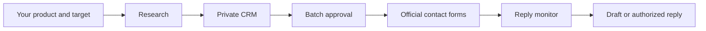

# ShipThenSell

### You ship. Codex helps you sell.

An open-source sales workflow for builders who would rather be building.
Research prospects, prepare outreach, and keep up with replies from a Codex project.

We want useful products to reach the people who need them. Building a product
already takes your attention; researching potential customers and answering
replies should have a place in your daily workflow, too.

[日本語](README.ja.md) · [Setup](docs/setup.md) · [Workflow](docs/crm.md) · [MIT](LICENSE)

## Start with one prompt

```sh
git clone https://github.com/yoshi0703/shipthensell.git
```

Open the clone as a project in Codex desktop, then ask:

> Set up ShipThenSell for my product. Ask me for the missing details, connect my
> CRM and mailbox, then register the three scheduled tasks in this project.

Codex follows the included setup skill, collects your product and sender details,
checks your connections and registers three schedules. Cloning the repo does not
enroll you. Private settings stay in your clone, outside Git.

## The daily loop

| When (your configured timezone) | Task | Result |
| --- | --- | --- |
| 03:00 | Research | Official contact forms, evidence and personalized drafts in your CRM |
| 10:00 | Outreach | Review a complete batch; Codex submits unchanged approved forms |
| Every 3 hours | Replies | Classify replies, draft answers and suggest available meeting times |



Research uses three concurrent tasks in two waves, up to 50 candidates each.
The outreach budget defaults to 50 attempts per shard, at most 150 total. These
are ceilings, not promises of qualified leads or delivered messages. All limits
and times are configurable. Replies default to drafts; explicitly opt into
quality-gated replies for positive, question and scheduling messages if desired.

## What's included

- A Codex setup skill with idempotent registration and pause/update instructions.
- Separate research, outreach and reply workflows with private CRM templates.
- A dependency-free Python helper for config validation, pinned schedule plans,
  deterministic sharding, approval manifests and reply recovery decisions.
- Offline tests and CI. No author mailbox, customer list, tracking or hosted backend.

**Status: initial workflow kit.** The helper runs locally; actual research, browser
actions and connectors are executed by Codex. Prompts are operational instructions,
not a sandbox or a guarantee of exactly-once delivery. Real scheduling and sending
must be verified on your account. This release supports one host per CRM.

## What stays in your hands

Approve the exact initial outreach batch before any form input. Respect no-sales
notices and opt-outs. Browser confirmations, CAPTCHA and user-only privacy consent
remain subject to host tool rules. The batch approval includes listed form
terms/privacy checkboxes when delegated operation is allowed. Eligibility checks
cover the form page only, without crawling linked policies; known bans still apply. Unknown send
results are recorded and never retried automatically. Meeting times are proposals;
no calendar invitations are created.

You'll need Codex desktop with automation/task tools, Google Drive/Sheets, Gmail,
Google Calendar and the in-app browser, plus Python 3.11+. Availability and service
costs depend on your accounts. [Read the setup requirements](docs/setup.md).

## Contribute

Try the setup with test data, report the precise step that failed, or improve an
adapter/workflow. Do not include real prospect data or email contents in issues.
See [CONTRIBUTING.md](CONTRIBUTING.md). Community project; not affiliated with or
endorsed by OpenAI. Licensed under MIT.

## Workflow v2

Qualified saved rows can proceed after a reconciled partial research run. Prior
unattempted backlog is carried forward with fresh checks; daily per-shard limits
include every run and resume. Pending approval releases ownership only after all
workers are confirmed stopped and checkpoints are durable. Reply monitoring can
then continue. Coordinator approval handoff is conditional on host support.
See [migration and approval scope](docs/crm.md) before upgrading: v2 form bindings
require new approval for unattempted rows. Explicit approvals and no-retry rules
remain in force. Copywriting uses verified recipient facts and one relevant offer.
